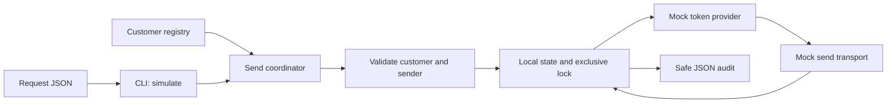

# Architecture

I chose .NET 10 for the first local sender and PowerShell for Exchange checks. It
keeps the Windows workflow small and makes the send logic usable from a future
API without adding hosting now. .NET 10 is an LTS release; maintainers still need
to rebuild packaged demos when its bundled runtime is patched.
[.NET support policy](https://dotnet.microsoft.com/en-us/platform/support/policy/dotnet-core)

`M365ScopedMail.Core` owns validation, Graph-shaped payloads, and the send state machine.
`M365ScopedMail.Cli` reads bounded strict JSON and wires only mocked dependencies.
`ITokenProvider`, `ISendTransport`, `IStateStore`, and `IAuditSink` are the adapter
boundaries. There is no HTTP listener, live transport, token acquisition, or
certificate-store access in this implementation.

## Binding and payload

The registry maps each lower-case customer ID to a fixed tenant, customer Enterprise
Application object ID, mailbox object ID, and sender. The caller cannot supply a
tenant. Unknown or duplicate JSON properties fail. A disabled customer, unexpected
sender, or invalid payload stops before the token or transport boundary. Token
envelopes must identify the mapped tenant.

The resulting path is `/v1.0/users/{mailboxObjectId}/sendMail`. Requests contain a
text body, one to ten distinct recipients, a subject up to 200 characters, and at
most one PDF of 1 MiB. Text is limited to 64 KiB of UTF-8. The filename is a simple
leaf name; the PDF check verifies size, base64, and header, not document safety.
`saveToSentItems` is true. See Microsoft’s [sendMail](https://learn.microsoft.com/en-us/graph/api/user-sendmail?view=graph-rest-1.0)
and [file attachment](https://learn.microsoft.com/en-us/graph/api/resources/fileattachment?view=graph-rest-1.0)
formats. `MockAccepted` means a mock accepted this shape; even a real Graph `202`
would mean acceptance, not completed delivery.

## State and recovery

Keep one persistent state directory for a workflow. Its exclusive file lock fails
closed on competing invocations. State is written through a temporary file before
transport submission, then replaced atomically. Local state is bounded to 10,000
submission records and 1,000 customers. It needs an explicit retention design
before long-running use; reaching capacity stops new work.

An idempotency key is customer-specific. Its hash and a fingerprint bind the full
request and customer configuration. Reusing an accepted key suppresses transport;
changing its payload or binding rejects it. A token failure can be retried with
the same request because submission did not start. `Pending` or `Uncertain` records
stop for manual investigation after a crash, cancellation, or ambiguous transport
failure. Do not delete state or invent a new key to bypass that stop.

Each customer gets five transport attempts per minute. Two authorization denials
open that customer’s circuit for five minutes. Both controls persist between CLI
runs. Explicit mock throttling retries once after 250 ms; this is a test behavior.
A future live adapter must honor Graph’s `Retry-After` and use suitable backoff.
Ambiguous results are never automatically resubmitted.
[Microsoft throttling guidance](https://learn.microsoft.com/en-us/graph/throttling)

Audit records contain UTC time, event ID, mapped customer/tenant/sender, recipient count,
attempts, status, and a limited error category. They omit tokens, recipients,
subject, body, and attachment content. Audit and state failures are visible in the
result. These local files require normal operating-system access control; this
demo does not provide tamper-resistant storage or multi-host coordination.
